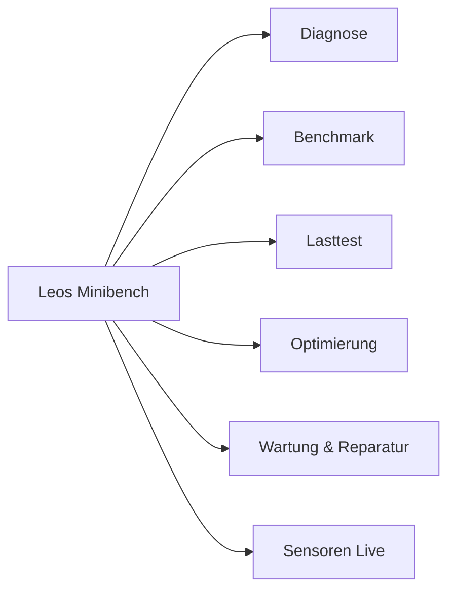

<div align="center">


# Leos Minibench

**Die portable Diagnose-, Benchmark-, Stresstest-, Reparatur- und Optimierungs-Suite für Windows 10 und Windows 11.**

[](Doku/Versionshistorie.txt)
[-0078d4.svg)]()
[]()
[](tests/)
[]()
[]()

</div>

---

## Über das Projekt

**Leos Minibench** wurde speziell für den praktischen Einsatz durch PC-Techniker, IT-Administratoren und ambitionierte Schrauber entwickelt. Die Anwendung läuft direkt von einem **USB-Stick** oder Wechsellaufwerk und erfordert keinerlei Installation auf dem Zielrechner.

### Die Kernphilosophie
* **Zero-Footprint (Spurenlosigkeit):** Auf dem geprüften Computer verbleiben keine Dateien. Alle Berichte, Datenbankeinträge und Logdateien landen im Ordner `Minibench-Daten` neben dem Werkzeug. Am Ende jedes Laufs kontrolliert eine automatische Rückstandskontrolle das System und räumt temporäre Dateien vollständig ab.
* **Autarkes Single-File-Programm:** Die Suite wird über den Windows-eigenen C#-Compiler (`csc.exe`) in eine kompakte `LeosMinibench.exe` mit integriertem Startfenster und automatischer Rechteerhöhung (UAC) kompiliert. Ein Start über `.cmd` oder `.ps1` ist als Fallback jederzeit möglich.
* **Transaktionssicherheit & Reversibilität:** Jede Veränderung am Zielsystem wird mit Vorher- und Nachher-Werten im Änderungsprotokoll dokumentiert. Über die integrierte Seite *Änderungen* können Anpassungen selektiv rückgängig gemacht werden. Vor tiefergehenden Eingriffen wird automatisch ein Systemwiederherstellungspunkt angelegt.
* **KI-gestützte Analyse:** Nach jedem Diagnoselauf erzeugt das Werkzeug neben detaillierten HTML- und Textberichten eine datenschutzbereinigte `KI-Datei.txt` mit vorkonfiguriertem System-Prompt, die direkt in LLMs (wie Gemini, ChatGPT oder Claude) für fundierte Reparatur- und Ursachenanalysen eingefügt werden kann.

---

## Die Module im Überblick



### 1. Diagnose
Vollständiges Inventar von Hardware, Betriebssystem, Treibern und Windows-Diensten.
* **Komponenten:** Prozessor, Arbeitsspeicher, Grafikkarte, Mainboard, BIOS, Datenträger und Akku (inkl. Verschleißgrad und Zyklen).
* **Prüfungen:** Dateisystem- und Systemdateien-Integrität, SMART-Attribute und SMART-Langtest, ausstehende Updates, Windows Defender Schnellscan und Netzwerk-Latenz.
* **Fehleranalyse:** Auswertung der Windows-Ereignisprotokolle, Crash-Checkpoints und automatischer Nachweis thermischer oder leistungsmäßiger Drosselung.

### 2. Benchmark
Präzise, reproduzierbare Leistungsbewertung aller Kernkomponenten.
* **Prozessor:** Single-Core, Multi-Core, AES-Verschlüsselung, SHA-256-Hashing und Deflate-Kompression.
* **Arbeitsspeicher:** Speicher-Lesen, Schreiben, Kopieren und Zugriffs-Latenzen (in Nanosekunden).
* **Grafik:** Eigener Direct3D 11 Rendertest mit Vollbild- oder Fenstervorschau, FPS-Messung, Frame-Punkte-Bewertung sowie Trennung von dedizierter Grafikkarte (dGPU) und Prozessorgrafik (iGPU).
* **Datenträger & WinSAT:** Sequentielles und zufälliges Lesen/Schreiben (R1, R8, W1, SR, SW) sowie offizielle Windows-Leistungsbewertung.

### 3. Lasttest
Isolierte Stresstests zur Aufdeckung von Instabilitäten und Kühlproblemen.
* **Prozess-Isolation:** CPU- und RAM-Last laufen in einem isolierten Hintergrundprozess ohne Garbage-Collection-Einfluss.
* **Drosselnachweis:** Automatische Erkennung, ob das System wegen Temperatur (Thermal Throttling), Stromaufnahme (Power Limit) oder Firmware drosselt.
* **Schutz:** Konfigurierbare Abbruchschwellen für CPU- und GPU-Temperaturen (z. B. TjMax oder feste Grenzwerte).

### 4. Optimierung
163 native Systemeinstellungen aus dem Windows Optimisation Pack, strukturiert in 14 Kategorien:
* **Kategorien:** Datenschutz, Telemetrie, Werbung, Suche & KI, Hintergrunddienste, Apps, Explorer & Bedienung, Gaming & Energie.
* **Vorlagen:** Auswählbar über Profile wie *Minimal*, *Erweitert* und **Leos Empfehlung** (praxiserprobte Standardauswahl).
* **Sicherheit:** Jede Einstellung ist einzeln schaltbar, prüft den Ist-Zustand vorher ab und kann protokolliert rückgängig gemacht werden.

### 5. Wartung & Reparatur
Gezielte Problembehebung bei Windows-Fehlern und trägem Systemverhalten:
* **Systemreparatur:** SFC-Dateiprüfung, DISM-Komponentenreparatur, Netzwerk-Reset, Windows Update-Komponentenbereinigung.
* **Wartung:** Sicheres Leeren temporärer Ordner, Caches, des Komponentenspeichers und Ausführen der Datenträgerbereinigung.
* **Treiberbereinigung:** Optionale Anbindung des Display Driver Uninstaller (DDU) zur restlosen Entfernung beschädigter Grafiktreiber.

### 6. Sensoren Live & Vergleichsdatenbank
* **Live-Monitoring:** Anzeige von Temperaturen, Taktraten, Spannungen, Lüfterdrehzahlen und Leistungsaufnahme. Unterstützt native Treiberquellen sowie portable Hardware-Monitore.
* **Vergleichsdatenbank:** Vergleicht beliebige frühere Läufe ohne erneuten Benchmark. Systemeinträge können editiert (z. B. für Notizen wie *„Vor Repaste“* vs. *„Nach Kühlertausch“*) und nach allen Spalten sortiert werden.

---

## Projektstruktur

```text
MiniBench/
├── Aktueller Build/          # Fertiges Ausgabepaket für den USB-Stick (EXE, PS1, CMD, Stand.txt)
├── Archiv/                   # Automatische Sicherung älterer Versionen (Bauen.cmd legt sie an)
├── Doku/                     # Versionshistorie, Testmatrizen und detaillierte Änderungsdokumente
├── src/                      # Modulare Quelltexte
│   ├── 00_Kopf.ps1           # Parameterblock und unhandled error trap
│   ├── Bauplan.txt           # Festgelegte Zusammenbau-Reihenfolge
│   ├── Zusammenbau.ps1       # Compiler- und Validierungsskript
│   ├── Ablauf/               # Start- und Abschluss-Abläufe
│   ├── Bericht/              # HTML-Berichtsgenerierung, Stilvorlagen und KI-Datei
│   ├── Diagnose/             # SMART-Auswertungen und Diagnosehilfen
│   ├── Kern/                 # Basis-Laufzeit (Admin, Risiko, Checkpoints, Werkzeuge, DB)
│   ├── Module/               # Fachmodule mit Vertrag.psd1 und Ablauf.ps1
│   │   ├── Benchmark/
│   │   ├── Diagnose/
│   │   ├── Lasttest/
│   │   ├── Optimierung/
│   │   ├── Reparatur/
│   │   ├── Sensoren/
│   │   └── Wartung/
│   └── Oberflaeche/          # Modularisierte C# WinForms-GUI (DiagGui.cs, Modelle, Steuerelemente)
├── tests/                    # Pester-5/6 Testsuite (500+ automatisierte Tests)
├── Bauen.cmd                 # Baut das Gesamtprogramm und erzeugt LeosMinibench.exe
└── Testen.cmd                # Führt alle Unit- und Integrationstests aus
```

---

## Schnellstart

### Für Anwender (Vom USB-Stick)
1. Kopiere den Inhalt des Ordners `Aktueller Build/` auf einen USB-Stick.
2. Starte `LeosMinibench.exe` per Doppelklick (bestätige die Windows-UAC-Abfrage).
3. Wähle die gewünschten Module aus und klicke auf **Start**.
4. Nach Abschluss findest du Berichte, Messkurven und die KI-Analysedatei unter `Minibench-Daten\Berichte\`.

### Für Entwickler
Voraussetzungen: Windows 10/11 x64 mit Windows PowerShell 5.1 (oder PowerShell 7) und Pester 5/6.

* **Tests ausführen:**
  ```cmd
  Testen.cmd
  ```
  *(Über 500 Pester-Tests prüfen Modulverträge, Risikostufen, AST-Syntax und Auswertungslogik).*

* **Programm bauen:**
  ```cmd
  Bauen.cmd
  ```
  *(Führt den Syntax-Check durch, lässt die Testsuite laufen, kompiliert die C#-Exe via `csc.exe` und legt das fertige Bundle in `Aktueller Build/` ab).*

---

## Feste Entwicklungsvorgaben

Das Projekt folgt strengen Qualitätsregeln (siehe [AGENTS.md](AGENTS.md)):
* Quellcode-Änderungen erfolgen **ausschließlich in `src/`**, niemals direkt im generierten Skript oder im Build-Ordner.
* Alle Textdateien werden als **UTF-8 mit BOM** und **CRLF-Zeilenumbrüchen** gespeichert.
* Jedes Modul deklariert seine Schritte in einem formalen Modulvertrag ([Vertrag.psd1](src/Kern/Modulvertrag.ps1)) mit definierter Risikostufe (*Lesen*, *Aendern*, *Eingriff*, *Zerstörend*).
* Externe portable Werkzeuge werden im Manifest ([Werkzeuge.ps1](src/Kern/Werkzeuge.ps1)) über feste SHA-256 Prüfsummen geschützt.
