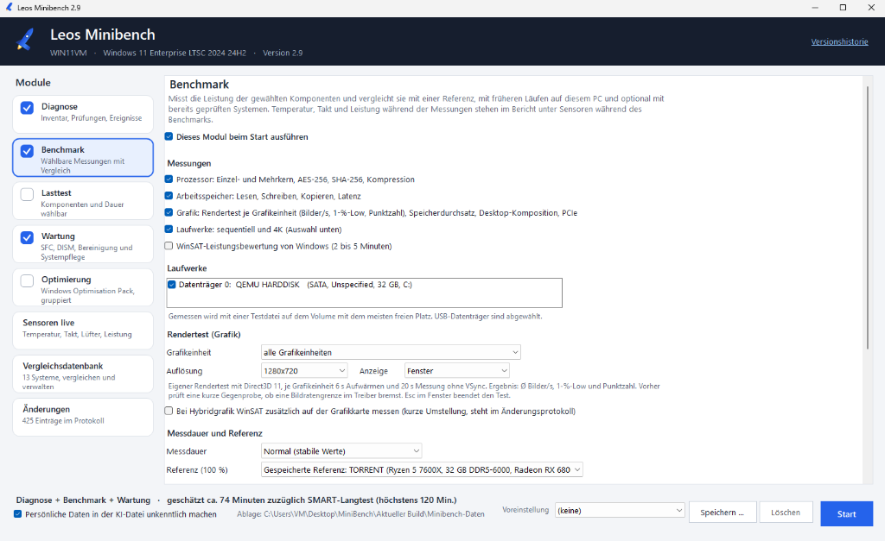



# Leos Minibench

**Portable Diagnose-, Benchmark-, Stresstest-, Reparatur- und Optimierungs-Suite für Windows 10 & 11.**

[-0078d4.svg)]()

 

---

## Kernmerkmale

* **100 % Portabel (Zero-Footprint):** Startet direkt vom USB-Stick ohne Installation. Hinterlässt keine Dateien auf dem geprüften PC; eine automatische Rückstandskontrolle räumt temporäre Reste am Ende ab.
* **Autarke Single-File-EXE:** Baut per `csc.exe` in eine eigenständige `LeosMinibench.exe` mit integriertem Startfenster und UAC-Rechteerhöhung (Fallback über `.cmd` oder `.ps1`).
* **Sicher & Reversibel:** Jede Systemänderung wird protokolliert und kann selektiv zurückgenommen werden. Automatischer Systemwiederherstellungspunkt vor tiefen Eingriffen.
* **KI-Diagnosedatei:** Erzeugt neben HTML-/TXT-Berichten eine anonymisierte `KI-Datei.txt` mit System-Prompt für Ursachen- und Reparaturanalysen in LLMs (Gemini, Claude, ChatGPT).

---

## Module

* **Diagnose:** Vollständiges Hardware- & OS-Inventar, SMART-Werte, Akku-Verschleiß, Ereignisprotokolle, Absturzanalyse und Drosselnachweis.
* **Benchmark:** CPU (Single/Multi, Krypto, Deflate), RAM (Bandbreite & Latenz), Datenträger (NVMe/SSD/USB), Direct3D 11 GPU-Rendertest (FPS, Frametimes, Punkte) und WinSAT.
* **Lasttest:** Isolierte CPU- und RAM-Last ohne GC-Einfluss, GPU-Rendertest, thermischer Drosselnachweis und konfigurierbare Abbruchschwellen (°C).
* **Wartung & Reparatur:** SFC, DISM, Netzwerk-Reset, Windows Update Reset, Bereinigung von Caches/Komponentenspeicher und DDU-Treiberbereinigung.
* **Optimierung:** 163 native Windows-Einstellungen in 14 Kategorien, inklusive Preset *Leos Empfehlung* und Einzel-Rollback.
* **Sensoren Live & Vergleich:** Echtzeit-Monitoring von Temperatur, Takt, Lüfter und Leistung; historische Vergleichsdatenbank mit sortierbaren Spalten und editierbaren Systemnamen.

---

## Beispielberichte

Das Werkzeug erzeugt nach jedem Lauf detaillierte, interaktive HTML-Berichte mit SVG-Diagrammen:

* 📊 **[Beispiel-Diagnosebericht (HTML)](Doku/Beispiele/Beispiel_Diagnosebericht.html)** – Vollständiger Hardware-, Sensor-, Lasttest- und Benchmark-Bericht.
* 📈 **[Beispiel-Systemvergleich (HTML)](Doku/Beispiele/Beispiel_Systemvergleich.html)** – Interaktiver Gegenüberstellungsbericht mehrerer Rechner aus der Datenbank.

---

## Schnellstart

### Für Anwender (USB-Stick)
1. Inhalt aus `Aktueller Build/` auf einen USB-Stick kopieren.
2. `LeosMinibench.exe` per Doppelklick als Administrator starten.
3. Module auswählen und **Start** klicken. Berichte landen unter `Minibench-Daten\Berichte\`.

### Für Entwickler
* **Tests ausführen:** `Testen.cmd` (über 500 Pester-Tests für Modulverträge, Risikostufen und AST-Syntax).
* **Programm bauen:** `Bauen.cmd` (Syntaxprüfung, Testlauf, EXE-Kompilierung und automatische Archivierung nach `Aktueller Build/`).
* **Vorgaben:** Quellcode-Änderungen nur in `src/`, UTF-8 mit BOM + CRLF, Modulverträge in `Vertrag.psd1` einhalten (Details in [AGENTS.md](AGENTS.md)).
